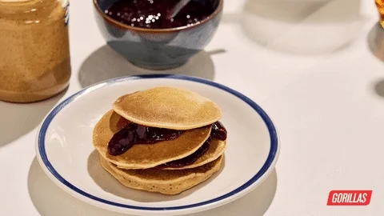

<a name="readme-top"></a>

<div align="center">
  <h3><b>Recipe APP</b></h3>
  </br>
  
  <br>
</div>


# 📗 Table of Contents

- [📗 Table of Contents](#-table-of-contents)
- [📖 \[Recipe App\] ](#-recipe-app-)
  - [🛠 Built With ](#-built-with-)
    - [Tech Stack ](#tech-stack-)
    - [Key Features ](#key-features-)
  - [🚀 Live Demo ](#-live-demo-)
  - [💻 Getting Started ](#-getting-started-)
    - [Prerequisites](#prerequisites)
    - [Setup](#setup)
    - [Install](#install)
    - [Usage](#usage)
    - [Run tests](#run-tests)
  - [👥 Authors ](#-authors-)
  - [🔭 Future Features ](#-future-features-)
  - [🤝 Contributing ](#-contributing-)
  - [⭐️ Show your support ](#️-show-your-support-)
  - [🙏 Acknowledgments ](#-acknowledgments-)
  - [📝 License ](#-license-)

<!-- PROJECT DESCRIPTION -->

# 📖 [Recipe App] <a name="about-project"></a>

**The Recipe App keeps track of all your recipes, ingredients, and inventory. It will allow you to save ingredients, keep track of what you have, create recipes, and generate a shopping list based on what you have and what you are missing from a recipe. Also, since sharing recipes is an important part of cooking the app should allow you to make them public so anyone can access them.** 

## 🛠 Built With <a name="built-with"></a>

### Tech Stack <a name="tech-stack"></a>


<details>
  <summary>Client</summary>
  <ul>
    <li><a href="https://rubyonrails.org/">ROR</a></li>
  </ul>
</details>

<details>
  <summary>Server</summary>
  <ul>
    <li><a href="https://rubyonrails.org/">ROR</a></li>
  </ul>
</details>

<details>
<summary>Database</summary>
  <ul>
    <li><a href="https://www.postgresql.org/">PostgreSQL</a></li>
  </ul>
</details>

<!-- Features -->

### Key Features <a name="key-features"></a>

- **Add Foods**
- **Display Foods**
- **Add Recipe**
- **Display Recipe**
- **Add Ingredient**
- **Display Ingredient**
- **Generate Shopping list**


<p align="right">(<a href="#readme-top">back to top</a>)</p>

<!-- LIVE DEMO -->

## 🚀 Live Demo <a name="live-demo"></a>

- [Coming soon]()

<p align="right">(<a href="#readme-top">back to top</a>)</p>

<!-- GETTING STARTED -->

## 💻 Getting Started <a name="getting-started"></a>

To get a local copy up and running, follow these steps.

### Prerequisites

In order to run this project you need:
```sh
  Ruby version - ruby 3.1.2 
  Rails version - Rails
  Chrome Browser 
  Vscode Optional
```

### Setup

Clone this repository to your desired folder:


```sh
  git clone https://github.com/Miliyonayalew/recipe-app.git
  cd recipe-app
```

### Install

Install this project with:

```sh
  Run bundle install 
  Run rails db:create
  Run rails db:migrate
```

### Usage

To run the project, execute the following command:

```sh  
  rails server or rails s 
```


### Run tests

To run tests, run the following command:


```sh
  To Run all tests - rspec
  To Run model tests - rspec spec/models
  To Run integration tests - rspec spec/views
```

<p align="right">(<a href="#readme-top">back to top</a>)</p>

<!-- AUTHORS -->

## 👥 Authors <a name="authors"></a>


👤 **Miliyon Ayalew**

- GitHub: [@Miliyonayalew](https://github.com/Miliyonayalew/)
- Twitter: [@Miliyonayalew](https://twitter.com/MilaAyalew)
- LinkedIn: [Miliyonayalew](https://www.linkedin.com/in/miliyon-ayalew-210808131/)

👤 **David Tamayo**

- GitHub: [@IngDavidTM](https://github.com/IngDavidTM)
- Twitter: [@David5TM](https://twitter.com/David5TM)
- LinkedIn: [LinkedIn](https://www.linkedin.com/in/ing-david-tamayo)

<p align="right">(<a href="#readme-top">back to top</a>)</p>

<!-- FUTURE FEATURES -->

## 🔭 Future Features <a name="future-features"></a>

> Describe 1 - 3 features you will add to the project.

- [ ] **Add Search Recipe and Food**
- [ ] **Add Pagination or infinite scrolling for the lists.**
- [ ] **Improve the UI**

<p align="right">(<a href="#readme-top">back to top</a>)</p>

<!-- CONTRIBUTING -->

## 🤝 Contributing <a name="contributing"></a>

Contributions, issues, and feature requests are welcome!

Feel free to check the [issues page](https://github.com/Miliyonayalew/recipe-app/issues).

<p align="right">(<a href="#readme-top">back to top</a>)</p>

<!-- SUPPORT -->

## ⭐️ Show your support <a name="support"></a>


If you like this project please give it a ⭐️!

<p align="right">(<a href="#readme-top">back to top</a>)</p>

<!-- ACKNOWLEDGEMENTS -->

## 🙏 Acknowledgments <a name="acknowledgements"></a>

I would like to thank the following people for their support and guidance:

- [Microverse](https://www.microverse.org/)
- Code reviewers
- Coding partners

<p align="right">(<a href="#readme-top">back to top</a>)</p>


<!-- LICENSE -->

## 📝 License <a name="license"></a>

This project is [MIT](./LICENSE) licensed.

<p align="right">(<a href="#readme-top">back to top</a>)</p>
